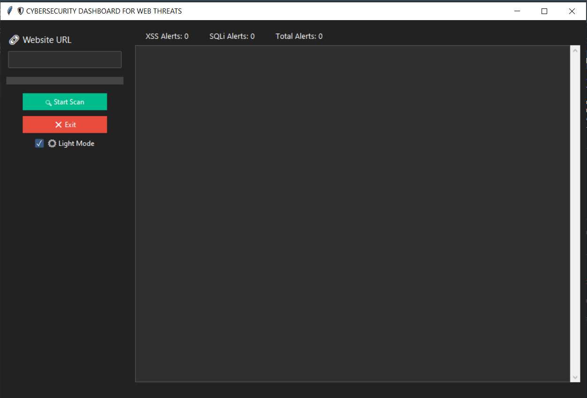

# 🛡️ Cybersecurity Dashboard for Web Threats

A Python-based desktop GUI that scans websites for XSSand SQL Injection vulnerabilities using the OWASP ZA API. The tool provides real-time logs, scan progress, vulnerability summaries, and visual graphs to enhance vulnerability analysis.

---

📸 Preview



---

# 🚀 Features

- 🌐 Scan any website for XSS and SQL Injection
- 📊 Graphical dashboard (line charts)
- 📝 Export results as `.txt` and `.csv`
- 🌗 Toggle between light and dark modes
- 📈 Real-time scan progress and vulnerability count

---

 # 🔧 Requirements

Make sure you have the following installed:

```bash
pip install ttkbootstrap python-owasp-zap-v2.4 matplotlib
```

You also need to install and run OWASP ZAP:

- Download ZAP: [https://www.zaproxy.org/download/](https://www.zaproxy.org/download/)
- Start ZAP and ensure the API is enabled with a valid API key.

---
# ⚙️ Configuration

In your Python script (`Dashboard.py`):

```python
API_KEY = 'your_zap_api_key'
ZAP_PROXY = 'http://127.0.0.1:8080'
```

Make sure the API key and port match your ZAP settings.

---

# 🖥️ How to Run

```bash
python file3.py
```

Or run it from an IDE like Spyder, VS Code, or PyCharm.

---

# 📁 Output Files

After a scan, results are saved to:

- `scan_results.txt`
- `scan_results.csv`

These include vulnerability names, risk levels, descriptions, and affected URLs.

---
 # 📉 Graphs

The dashboard shows a simple line graph indicating the number of detected:
- XSS vulnerabilities
- SQL injection vulnerabilities
- Total alerts

You can extend this to include bar charts, pie charts, or timelines.

---

# 🛠 Future Enhancements (Optional)

- Add support for CSRF, SSRF, etc.
- Export PDF reports
- Add historical scan tracking

---

# 🧑‍💻 Author

- vijay kumar B S
- GitHub: [VIJAY KUMAR B S](https://github.com/vijayappugowda?tab=repositories)
- Contact: vijayappugowda@gmail.com

---

# 📜 License

MIT License

Copyright (c) 2025 Vijay Kumar B S

Permission is hereby granted, free of charge, to any person obtaining a copy
of this software and associated documentation files (the "Software"), to deal
in the Software without restriction, including without limitation the rights  
to use, copy, modify, merge, publish, distribute, sublicense, and/or sell  
copies of the Software, and to permit persons to whom the Software is  
furnished to do so, subject to the following conditions:

The above copyright notice and this permission notice shall be included in  
all copies or substantial portions of the Software.

THE SOFTWARE IS PROVIDED "AS IS", WITHOUT WARRANTY OF ANY KIND, EXPRESS OR  
IMPLIED, INCLUDING BUT NOT LIMITED TO THE WARRANTIES OF MERCHANTABILITY,  
FITNESS FOR A PARTICULAR PURPOSE AND NONINFRINGEMENT. IN NO EVENT SHALL THE  
AUTHORS OR COPYRIGHT HOLDERS BE LIABLE FOR ANY CLAIM, DAMAGES OR OTHER  
LIABILITY, WHETHER IN AN ACTION OF CONTRACT, TORT OR OTHERWISE, ARISING  
FROM, OUT OF OR IN CONNECTION WITH THE SOFTWARE OR THE USE OR OTHER DEALINGS  
IN THE SOFTWARE.
